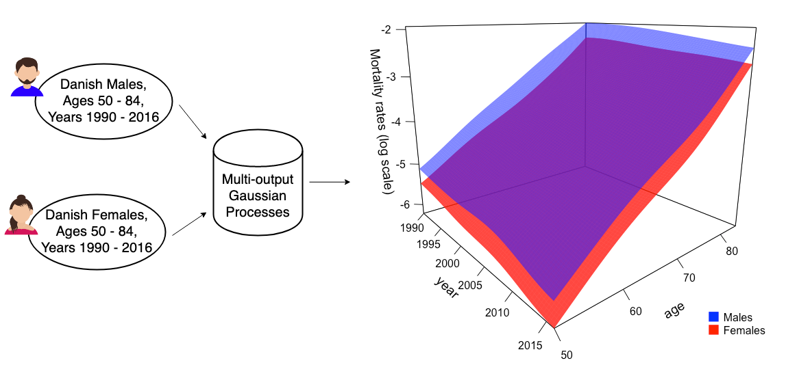

<style>
  .col2 {
    columns: 2 200px;         /* number of columns and width in pixels*/
    -webkit-columns: 2 200px; /* chrome, safari */
    -moz-columns: 2 200px;    /* firefox */
  }
  .list-group-item.active, .list-group-item.active:focus, .list-group-item.active:hover {
    background-color: #8c3c67;
  }
</style>

<style type="text/css">
body{ /* Normal  */
  font-size: 15px;
  height: 100%;
  overflow: auto;
}
html {
    overflow: hidden;
    height: 100%;
}
h1.title {
  font-size: 35px;
  font-weight: Bold;
  font-style: Italic;
  color:  #c64329;
}
h1 { /* Header 1 */
  font-size: 28px;
  color:  #c64329;
}
h2 { /* Header 2 */
  font-size: 25px;
  color: #c64329;
}
h3 { /* Header 3 */
  font-size: 20px;
  color: #c64329;
}
h4.author {
  font-size: 20px;
  color: #0047d6;
}
</style>

```{r, echo = FALSE, warning = FALSE, message = FALSE, setup}
knitr::opts_chunk$set(echo = TRUE, warning = FALSE, message = FALSE, comment = NA)
options("digits"=4)
```

<hr>

Our methodology treats age-specific mortality rates as a noisily observed (statistically speaking) response surface. The modeling goal is to de-noise the data and then interpolate/extrapolate to make predictions. In our set up, the surface is indexed by Age, Year, and Population. The noise arises due to random fluctuations in observed mortality and various reporting irregularities, with our objective to infer the "true" latent mortality rates. Below, the 3-D ribbon on the left illustrates a typical raw log-mortality surface for Danish Males and the smoothed surface obtained from a Gaussian Process model on the right. We observe the prevalent patterns such as log mortality increasing in Age and decreasing gradually over the Year dimension. 

```{r, echo = FALSE, fig.show = "hold", out.width = "50%", fig.align = "default"}
knitr::include_graphics("Denmark-raw.png")

```

# Gaussian Process Regression 

__A Gaussian process (GP)__ is an infinite collection of random variables, any finite number of which follows a multivariate normal (MVN) distribution. As such, a GP  $f \sim GP( m, C)$ is characterized by its mean function $m(x)$ and its covariance structure $C(x,x')$. This means that for any vector $\mathbf{x}=(x^1,\ldots,x^n)$ of $n$ inputs:
$$f(x^1),\ldots,f(x^n) \sim \mathcal{N}\big(\mathbf{m(x)},\mathbf{C(x,x)}\big)$$
where $\mathbf{m(x)}=\mathbb{E}[f(\mathbf{x})]$ is the mean vector of size $n$ and $\mathbf{C(x,x)}$ is the $n$ by $n$ covariance matrix, $C(x,x') := \mathbb{E}[(f({x})-{m(x)})(f({x'})-{m(x')})]$.

In a GP regression setup, the latent $f$ links the observations or output vector $\mathbf{y}=(y^1,\ldots,y^n)$ to the input vector $\mathbf{x}$ via:
$$y^i = f(x^i) + \epsilon^i,$$
where $\epsilon^i$ is the error term to reflect that we observe only a noisy sample of $f(x^i)$. In our context, $x^i$ are the individual cells in a mortality table (so indexed by Age, Year, etc.), $y^i$ are observed raw log mortality rates, and $f(x^i)$ is the _true_ mortality rate that would materialize in the absence of any random shocks. Note that this perspective implies that there is absolutely _no_ time-series flavor to our model. The Year dimension is treated exactly the same as the Age dimension. Therefore, future projections are purely statistical _extrapolations_ and have no explicit dynamics. One benefit is that because the GP framework is inherently probabilistic, future _scenarios_ are simply samples from the GP (i.e. are $f(x')$ for out-of-sample cells $x'$ and therefore do not require the modeler to prescribe any additional assumptions about how mortality rates ought to evolve. In that sense, GP-based projections are entirely data-driven (apart from the Bayesian prior incorporated in the mean function $m(\cdot)$).

We postulate that observation noise is Gaussian: $\epsilon^i \sim \mathcal{N}(0,\sigma^2)$ or $\epsilon=(\epsilon^1,...,\epsilon^n) \sim \mathcal{N}(\mathbf{0},\mathbf{\Sigma}=\text{diag}(\sigma^2))$. This means that the observed log-mortality is the true population log-mortality plus normally-distributed "errors".
It follows that $$\text{Cov}(y^i,y^j) = \text{Cov}(f(x^i),f(x^j)) + \sigma^2\delta(x^i,x^j)$$  where $\delta(x^i,x^j)$ is the Kronecker delta.

__Prediction in GP__

The objective is to draw prediction about $\mathbf{f_*} \equiv f(\mathbf{x_*})$ or future observations $\mathbf{y_*} \equiv Y(\mathbf{x_*})$ at new inputs $\mathbf{x_*}$. By construction, $\mathbf{y}$ and $\mathbf{y_*}$ follow a joint MVN distribution:

$$\begin{equation*}
\begin{bmatrix}
    \mathbf{y} \\
    \mathbf{y_*}
 \end{bmatrix}
 \sim \mathcal{N}\Bigg(
 \begin{bmatrix}
     \mathbf{m} \\
     \mathbf{m_{*}}
 \end{bmatrix},
 \begin{bmatrix}
     \mathbf{C+\Sigma} & \mathbf{C(x,x_*)} \\
     \mathbf{C(x,x_*)}^T & \mathbf{C_{**}+\Sigma_{**}}
 \end{bmatrix}
 \Bigg)
\end{equation*}$$

where $\mathbf{C(x,x_*)}$ is the covariance matrix between training inputs $\mathbf{x}$ and test inputs $\mathbf{x_*}$, $\mathbf{C}_{**}$ is the covariance matrix of $\mathbf{x_*}$, $\mathbf{\Sigma_{**}}=\text{diag}(\sigma^2)$ is the noise variance matrix of the test inputs $\mathbf{x_*}$, and $\mathbf{m_{*}} = m(\mathbf{x_*})$. The MVN formulas then imply that
$$\begin{align}
    p(\mathbf{y_*|y}) & \sim \mathcal{N}(\mathbf{m_*(x_*),C_*(x_*,x_*)}) \qquad \text{where} \\ \label{eq:mean1}
       \mathbb{E}[\mathbf{y_*|\mathcal{D}}] = \mathbf{m_*(x_*)} &\ = \mathbf{m+C(x,x_*)}^T[\mathbf{C+\Sigma}]^{-1}(\mathbf{y-m}); \\ \label{eq:var1}
    \mathbb{V}ar(\mathbf{y_*}|\mathcal{D}) = \mathbf{C_*(x_*,x_*)} &\ = \mathbf{C_{**}+\Sigma_{**}}-\mathbf{C(x,x_*)}^T[\mathbf{C+\Sigma]}^{-1}\mathbf{C(x_*,x)}.
\end{align}$$
Note that the posterior variance $\mathbf{C_*(x_*,x_*)}$ is equal to the prior variance $\mathbf{C_{**}+\Sigma_{**}}$ minus a positive term which reflects the information gained (relative to the prior) from the training data. 

__GP Hyperparameters__

The role of the mean function $m(\cdot)$ is to capture the global longevity trend (e.g. linear in year for the log-mortality), and the role of the covariance kernel is to capture the co-dependence of mortality rates across similar Ages or calendar Years. Namely, the value of $C(x^i,x^j)$ captures the correlation between mortality rates at the given Age and Year coordinates. For example, we expect the mortality for age 70 in 2010 or $x^i=(70,2010)$, to be more correlated with $x^j=(69,2011)$ than with $x^j=(50,1995)$. In our model this is achieved by specifying a *functional* form for $C(x,x')$ and then fitting the respective hyperparameters through Maximum Likelihood optimization.

Specifically, we utilize the squared exponential kernel to capture the dependence of log-mortality on Age and Year:
$$
\tilde{C}(x^i,x^j) := \eta^2\exp{\Bigg[-\dfrac{(x^i_{ag}-x^j_{ag})^2}{2\theta_{ag}^2}-\dfrac{(x^i_{yr}-x^j_{yr})^2}{2\theta^2_{yr}}\Bigg]}.
$$
The above kernel function is parametrized through the scalar quantities $\eta, \theta_{ag}, \theta_{yr}$. The hyper-parameter Eta $\eta$ is the process variance. The hyper-parameter Theta-Age $\theta_{ag}$ is the lengthscale in the Age coordinate. The hyper-parameter Theta-Year $\theta_{yr}$ is the lengthscale in the Year coordinate. Low lengthscales make the model hue tightly to the observations and "oscillate" or "over-fit" the trend. High lengthscales lead to near-linear fits and "over-smoothing". The best lengthscales, along with the respective process variance, are obtained by maximizing the Gaussian likelihood of observations with respect to the latent model that is specified by the triple $(\eta, \theta_{ag}, \theta_{yr})$. See the [arXiv](https://arxiv.org/abs/2003.02443) preprint for additional Bayesian methodology that explores the respective uncertainty of the fitted model.

# Multi-output Gaussian Processes #

We proceed to use the GP framework to simultaneously model multiple longevity surfaces by capturing the underlying commonality of mortality patterns (e.g: In the diagram below, we obtain the two smoothed mortality surfaces for Males and Females in Denmark after fitting MOGP model). The approach of the respective multi-output GP is to impose a transparent correlation structure on the co-dependence of mortality rates across populations, disentangling it from the global Age-Year pattern.
Let $L$ be the number of populations under consideration. To jointly model the $L$ different outputs, $\{f_l\}_{1\leq l \leq L}$ we correlate them using the framework of multi-output Gaussian Processes (MOGP) which was introduced in geostatistics under the name of multivariate  kriging or co-kriging. 

```{r, echo = FALSE, fig.show = "hold", out.width = "95%", fig.align = "center"}

```

The vector-valued latent response over the Age-Year input space is defined as:
$$\mathbf{f(x)}=(f_1(x^1),\ldots,f_1(x^N),\ldots,f_L(x^1),\ldots,f_L(x^N))=(f_1(\mathbf{x}),\ldots,f_L(\mathbf{x}))$$ where the functions $\{f_l\}_{l=1}^L$ are the log-mortality surface for the corresponding population $l$. Similar to single-output GP (SOGP), MOGP assumes that the vector-valued $\mathbf{f}$ follows a GP:
$$\mathbf{f} \sim GP(\mathbf{m,C})$$
where $\mathbf{m} \in \mathbb{R}^{LN \times 1}$ is the mean vector whose elements $\{m_l(\mathbf{x})\}_{l=1}^L$ are the mean functions of each output, and $\mathbf{C} \in \mathbb{R}^{LN \times LN}$ is the fused covariance matrix.

## Performance metrics

The most common choice is root mean squared error (RMSE) to assess model performance. However RMSE is highly sensitive to outliers and also to the fact that mortality errors will be necessarily larger at higher Ages due to smaller exposed cohorts. To remedy this, we employ the mean absolute percentage error (MAPE) metric, specifically its symmetric (SMAPE) version that corrects for the tendency of MAPE to put heavier penalties on over-estimating the observations:
\begin{equation}
    \text{SMAPE} := \frac{100}{M} \sum_{i=1}^M \frac{|y^i_*-m_*(x^i_*)|}{(|y^i_*|+|m_*(x^i_*)|)/2},
\end{equation}
where $y^i_*$ is the realized observed value at test input $x_*^i$ and $m_*(x^i_*)$ is the predicted log-mortality rate by the model.  Unlike the squared errors, SMAPE is a scale-independent measure that is convenient to compare across different data sets. In addition to SMAPE, we also use the Continuous Ranked Probability Score (CRPS) metric to assess the quality of the probabilistic forecasts produced by a MOGP. For more detailed explanation and many illustrations on CRPS, we encourage the readers to visit the [arXiv](https://arxiv.org/abs/2003.02443) preprint.

## Mortality Improvement Factors 

It is common to interpret a mortality surface is via the (annual) mortality _improvement factors_ which measures longevity changes year-over-year. In terms of the observations, the raw annual percentage mortality improvement is: 
$$1-\dfrac{\exp{\big(y(x_{ag};x_{yr})\big)}}{\exp{\big(y(x_{ag};x_{yr}-1)\big)}}$$
The smoothed improvement factor is obtained by replacing $y$'s by the GP model posterior $m_*$'s:
$$\partial m_{back}^{GP}(x):=1-\dfrac{\exp{\big(m_*(x_{ag};x_{yr})\big)}}{\exp{\big(m_*(x_{ag};x_{yr}-1)\big)}}$$


