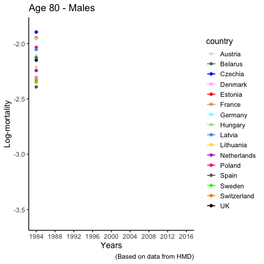
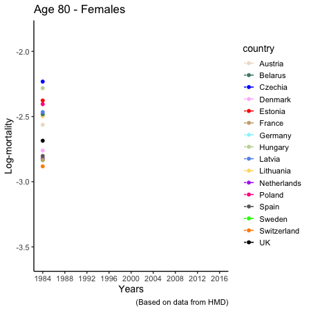

<style>
  .col2 {
    columns: 2 200px;         /* number of columns and width in pixels*/
    -webkit-columns: 2 200px; /* chrome, safari */
    -moz-columns: 2 200px;    /* firefox */
  }
  .list-group-item.active, .list-group-item.active:focus, .list-group-item.active:hover {
    background-color: #8c3c67;
  }
</style>

<style type="text/css">
body{ /* Normal  */
  font-size: 15px;
  height: 100%;
  overflow: auto;
}
html {
    overflow: hidden;
    height: 100%;
}
h1.title {
  font-size: 35px;
  font-weight: Bold;
  font-style: Italic;
  color:  #c64329;
}
h1 { /* Header 1 */
  font-size: 28px;
  color:  #c64329;
}
h2 { /* Header 2 */
  font-size: 25px;
  color: #c64329;
}
h3 { /* Header 3 */
  font-size: 20px;
  color: #c64329;
}
h4.author {
  font-size: 20px;
  color: #0047d6;
}
</style>

```{r, echo = FALSE, warning = FALSE, message = FALSE, setup}
knitr::opts_chunk$set(echo = TRUE, warning = FALSE, message = FALSE, comment = NA)
options("digits"=4)
```

```{r, echo = FALSE}
library(kableExtra) 
library(plotly)
library(ggplot2)
library(shiny)
```

<hr>

In [Tutorial I](MOGP_Mortality_Pops_Part1.html) and [II](MOGP_Mortality_Pops_Part2.html), we mainly focus on the use of MOGP model for _isotropic data_, or when all $L$ populations have the same set of inputs. In this tutorials, we will illustrate how to generalize this framework when we have missing data or when populations have different set of inputs. 

# Packages and user-defined functions

Loading all packages into the current working directory:

```{r, loadLibrary}
library(DiceKriging)
library(rgenoud)
library(kergp) 
library(nloptr)
library(data.table)
```

  * [`DiceKriging`](https://cran.r-project.org/web/packages/DiceKriging/DiceKriging.pdf): kriging methods for single-output GP (SOGP).
  * [`rgenoud`](https://cran.r-project.org/web/packages/rgenoud/rgenoud.pdf): genetic optimization solver used for Maximum Likelihood Estimation of GP hyperparameters.
  * [`kergp`](https://cran.r-project.org/web/packages/kergp/kergp.pdf): kriging methods for user-defined kernel, needed for both Full-rank and ICM Multi-output GP. 
  * [`nloptr`](https://cran.r-project.org/web/packages/nloptr/nloptr.pdf): solve nonlinear optimization using R interface to NLopt.
  * [`data.table`](https://cran.r-project.org/web/packages/data.table/data.table.pdf): extension of `data.frame` to enhance data manipulation. 

Loading all user-defined functions:

```{r, loadFunctions}
source("createMortData.R")
source("covICM_Notched.R")
source("gp_predictionNotched.R")
```

   * $\color{blue}{\texttt{createMortData.R}}$: to import datasets and select populations prior to model fitting. We can specify the age groups, calendar years, and whether both Males and Females are modeled together. All the datasets are downloaded from the [Human Mortality Database](https://www.mortality.org/). Currently, we have 16 European countries (seperated by gender) in Death Count and Exposures folders. These countries are: 
  <div class="col2">
      *  Austria  
      *  Belarus
      *  Czech
      *  Denmark
      *  Estonia  
      *  France  
      *  Germany  
      *  Hungary  
      *  Latvia 
      *  Lithuania  
      *  Netherlands 
      *  Poland  
      *  Spain 
      *  Sweden  
      *  Switzerland 
      *  UK  
  </div>  
<!-- Illustration on the historical evolution of the log- mortality rates for Age 80 from 1984--2016 in 16 European countries, separated by Males (left figure) and Females (right figure). We observed that Female populations have lower mortality rates than Male groups.  -->

<!-- <div class="col2">    -->
<!--   <div> -->
<!--    -->
<!--   </div> -->
<!--   <div> -->
<!--    -->
<!--   </div> -->
<!-- </div> -->
<!-- <p></p>&nbsp;  -->

  * $\color{blue}{\texttt{covICM_Notched.Rda}}$: to define ICM with partially heterotropic data where only a portion of $L$ inputs are available. This is useful as the reported data from different countries in the HMD arrives non-synchronously. For instance, as of March 2020 some countries already have 2018 data added, most have data up to 2017, and a few are still lagging and only have data up to 2016. \
Let $M'$ be the number of distinct inputs across $L$ populations and $M=N_1+...+N_L$ be the number of observations in training data. We consider the setting that $M'<ML$ so that for some inputs, not all $L$ outputs are observed. Define the vector-valued "complete data" function $\mathbf{f(x)}$, with $\mathbf{f(x)} \in \mathbb{R}^{LM' \times 1}$. We further introduce $\mathbf{f}^o\mathbf{(x)}$ as the vector-valued function corresponding to the observed outputs, $\mathbf{f}^o\mathbf{(x)} \in \mathbb{R}^{M \times 1}$. The relation between $\mathbf{f(x)}$ and $\mathbf{f}^o\mathbf{(x)}$ is formulated through the "communication" matrix $S$,
$\mathbf{f}^o\mathbf{(x)} = S^T\mathbf{f(x)}$,
where $S \in \mathbb{R}^{LM' \times M}$. The column vectors in $S$ are orthonormal with values of 0 and 1 to eliminate the unobserved outputs. Applying linear transformation to a MVN vector, we can then identify the distribution of $\mathbf{\mathbf{f}^o\mathbf{(x)}}$ as a GP with covariance: $$\text{Cov}(\mathbf{f}^o\mathbf{(x)},\mathbf{f}^o\mathbf{(x')})=S^T \text{Cov}(\mathbf{f(x)},\mathbf{f(x')})S = S^T(B \otimes K)S,$$ recovering the Kronecker structure.\
R function to create the transpose of the communication matrix, $S^T$:
```{r, createST}
## create ST (to transform the vector of latent functions to observed functions)
createST = function(df){
  unq.loc = unique(df[,1:2]) # loc = (age,year)
  npop = length(unique(df[,3])) # integer coding for different populations
  vec.pop = rep(1:npop,each=nrow(unq.loc))
  
  # re-create a full data:
  full = cbind(do.call("rbind", replicate(npop, unq.loc, simplify = FALSE)), vec.pop)
  
  lab.notch = paste(df[,1],df[,2],df[,3],sep="")
  lab.full = paste(full[,1],full[,2],full[,3],sep="")
  
  out = outer(lab.notch,lab.full,"==")
  out = ifelse(out==T,1,0)
  
  return(out)
}
```
For example, we have the "observed" data for two populations (coded as 1 and 2). Population 2 has a missing data at the coordinate (Age,Year)=(71,1991).\
```{r, echo = FALSE, observedDat}
X = data.frame(age = c(70,71,70),
               year = c(1990,1991, 1990),
               popN = c(1,1,2))
rownames(X) = c("r1","r2","r3")
df_html <- knitr::kable(X, "html",  caption = "Observed data")
kable_styling(df_html,bootstrap_options = "striped", full_width = F)
```
```{r, echo = FALSE, completeDat}
Xcomp = data.frame(age = c(70,71,70,71),
                   year = c(1990, 1991, 1990, 1991),
                   popN = c(1,1,2,2))
rownames(Xcomp) = c("r1","r2","r3","r4")
df_html <- knitr::kable(Xcomp, "html",  caption = "Complete data")
kable_styling(df_html,bootstrap_options = "striped", full_width = F)
```
Thus, the transpose of the communication matrix $S^T$ is:
```{r, echo = FALSE, ST}
ST = createST(X)
rownames(ST) = rownames(X)
colnames(ST) = rownames(Xcomp)
ST
```

  * $\color{blue}{\texttt{gp_predictionICM.R}}$: to perform prediction. Outputs contain the predicted mean and the posterior variance at new inputs $\mathbf{x_*}$ for the latent function $\mathbf{f_*}$ and observed outputs $\mathbf{y_*}$. The cross-covariance matrix between two sets of locations are also provided. 
  
Below, we write a function to create integer coding for populations in MOGP. This is equivalent to create dummy variables for categorical input. 

```{r, integerCode}
intCtry = function(ctry){
  # ctry: list of countries (or populations) in the model
  subdt = mortData[country %in% ctry] 
  ctry = ctry[order(ctry)]
  for (i in 1:length(ctry)){
    subdt[country==ctry[i], popN:=i]
  }
  return(subdt)
}
```

# Two-population ICM Model

For notched setup, let's pretend that Hungary has not yet had 2016 data while Estonia already does. The goal is to build a joint model for Hungary and Estonia and apply the model to predict 2016 log-mortality rates in Hungary. We then compare the prediction performance of this model, in terms of SMAPE and the standard deviation of $\mathbf{f_*}$ with ones in the single model for Hungary, using data in 1990--2015. 

## Fitting 2-population ICM model

The initial step is to prepare an aggregated data for Hungarian and Estonian mortality for Males, on Ages 70--84. 

```{r, notchedData}
mortData = createMortData(year_start=1990, year_end=2016, 
                          age_start=70, age_end=84, 
                          sex="m", sex_cat="no")

ctry = c("Estonia","Hungary")
mortData = mortData[country %in% ctry]
mortData = intCtry(ctry)
mortData = mortData[-which(country=="Hungary" & year==2016)] # remove 2016 Hungarian data
```

The output vector $(y)$ and input vector $(X)$ must be provided:

```{r, modelData}
y = mortData[,y]
X = mortData[,.(age,year,popN)]
X = as.matrix(X,ncol=3)
X = as.data.frame(X)
names(X) = c("x1","x2","x3")
```

Prior to fitting the model, we need to specify the number of populations, choice of rank, and more importaly provide the transpose of the communication matrix, $S^T$. Similar to [Part I](MOGP_Mortality_Pops_Part1.html) and [Par II](MOGP_Mortality_Pops_Part2.html), the function $\color{blue}{\texttt{gp()}}$ can be called to fit the model. Specifically, we define the ICM kernel through the $\color{blue}{\texttt{covICM_Notched()}}$ function with $\color{blue}{\texttt{rank = 2}}$ and $\color{blue}{\texttt{num_pop = 2}}$. 

```{r, cache=TRUE, fitNotched}
rank = 2
num_pop = 2
ST = createST(X)
gpFit <- gp(formula = y ~ X$x1 + as.factor(X$x3), 
            data = data.frame(y, X), 
            inputs = names(X), 
            cov = covICM_Notched(rank,num_pop),
            compGrad = FALSE,
            estim = TRUE, 
            noise = TRUE, 
            varNoiseIni = 1.0e-3, 
            varNoiseLower = 1.0e-5, 
            varNoiseUpper = 1.0e-2,
            parCovIni = c(10,10,rep(0.15,rank*num_pop)),
            # multistart = 4,
            optimMethod = "NLOPT_LN_COBYLA",
            opts=list("xtol_rel" = 1.0e-5,
                      "check_derivatives_tol" = 1.0e-5,
                      "population" = 120, 
                      # "print_level" = 2, 
                      "maxeval" = 150))
```

The summary output of the fitted model:

```{r}
summary(gpFit)
```

With the ICM covariance kernel, we can extract the factor loadings and compute the cross-covariance matrix $B$:

```{r}
a.loadings <- gpFit$covariance@par[3:length(gpFit$covariance@par)]
group.loadings <- split(a.loadings,ceiling(seq_along(a.loadings)/num_pop))
B <- Reduce("+",lapply(group.loadings,function(x) x%*%t(x)))
rownames(B) <- ctry; colnames(B) <- ctry
B
```

The inferred cross-correlation matrix $R$ from $B$:

```{r}
R <- cov2cor(B)
R
```

Hungary and Estonia are highly correlated with the correlation coefficient of $r_{EST,~HUN} \approx 0.98$. 

__2016 out-of-sample prediction for Hungary via 2-population ICM model__

We apply the fitted model to predict 2016 log-mortality rates for Ages 70--84 in Hungary. First, we create a test set:

```{r}
# new data frame for prediction 
yearsForecast = 2016
agesForecast  = 70:84
nYr = length(yearsForecast)
nAg = length(agesForecast)
npop = 2
    
xPred = data.frame(x1 = rep(agesForecast, npop),
                   x2 = rep(yearsForecast, each = npop),
                   x3 = rep(1:npop, each = nAg))
```

We further extract $\sigma^2_l$ from single-population models: $\sigma^2_{EST}$ from single-population for Estonia (Ages 70--84, Years 1990--2016) and $\sigma^2_{HUN}$ from single-population for Hungary (Ages 70--84, Years 1990--2015).  

```{r}
load("nugget_mortData.Rda")
nugget = nugget[country %in% ctry]
nugget = nugget[(country=="Hungary" & nug.year==2015)|(country=="Estonia" & nug.year==2016)]
(list.nug = nugget$nug)
```

Finally, we apply the user-defined function $\color{blue}{\texttt{gp.predictionNotch()}}$ from the source $\color{blue}{\texttt{gp_predictionNotched}}$ for prediction. Note that we have to provide the covariance matrix for new inputs in the test set ($\color{blue}{\texttt{covXnew}}$). Prior to estimate  $\color{blue}{\texttt{covXnew}}$, we must re-compute the transpose of the communication matrix, $S^T$, for the test set. 

```{r}
ST = createST(xPred); 
covXnew = covMat(gpFit$covariance, xPred)
    
ST = createST(gpFit$X)
out = gp.predictionNotch(newdata = xPred, 
                         gpmodel = gpFit, 
                         list.noise = list.nug, 
                         meanTr = "linearAg",
                         typePred = "f",
                         covXnew = covXnew)
predicted = out$res
```

Prediction results for Age 70 and 84 in Hungary:

```{r, echo=FALSE, display31}
df_html <- knitr::kable(predicted[c(16,30),], "html")
kable_styling(df_html,bootstrap_options = "striped", full_width = F)
```

We further compute SMAPE to assess model performance: 

```{r}
# data with observed values:
mortData = createMortData(year_start=2016, year_end=2016, age_start=70, age_end=84, sex="m", sex_cat="no")

yearsForecast = c(2013,2015,2016)
agesForecast = 70:84
observed= mortData[age %in% agesForecast & year %in% yearsForecast & country %in% ctry,]
observed = intCtry(ctry)

# merge observed data with predicted one:
compareGP = as.data.table(merge(predicted, observed, all.x=T, by=c("age","year","popN")))
smape = compareGP[,.(smape = mean(200*abs(y-mean)/(abs(y)+abs(mean)))),
                  by=.(country,year)]
```

```{r, echo = FALSE, display2}
df_html <- knitr::kable(smape, "html")
kable_styling(df_html,bootstrap_options = "striped", full_width = F)
```

Lastly, we extract the standard deviation of $f_*$ via the ICM model at new inputs: 

```{r}
hungaryNot.std = predicted$std[predicted$popN==2]
```

## Fitting single-population model for Hungary 

Assume that Hungary doesn't have 2016 mortality data available, one approach is to fit a single-population model, Ages 70--84 and Years 1990--2015 and perform one-year out forecast for 2016. The  $\color{blue}{\texttt{km()}}$ function in package `DiceKriging` is employed to fit the model:

```{r, cache=TRUE, fitSingle}
mortData = createMortData(year_start=1990,year_end=2015,age_start=70,age_end=84, sex="m",sex_cat="no")
mortData = mortData[country=="Hungary"]

# Single models:

xMort = data.frame(age = mortData$age, 
                   year = mortData$year)
  yMort = mortData$y
  mortSingle_nug = km(formula = ~x.age, 
                      design = data.frame(x = xMort), 
                      response = yMort,
                      nugget.estim=TRUE,
                      covtype="gauss",
                      optim.method="gen",
                      upper = c(45,45),
                      control=list(max.generations=100,pop.size=100,
                                   wait.generations=10,
                                   solution.tolerance=1e-5,
                                   print.level = 0))
  nug = mortSingle_nug@covariance@nugget 
  mortSingle = km(formula = ~x.age, 
                  design = mortSingle_nug@X, 
                  response = mortSingle_nug@y,
                  noise.var = rep(nug,mortSingle_nug@n), 
                  coef.trend = mortSingle_nug@trend.coef,  
                  coef.cov = mortSingle_nug@covariance@range.val,
                  coef.var = mortSingle_nug@covariance@sd2, 
                  covtype = mortSingle_nug@covariance@name)
```

The output of the single model for Hungary:

```{r}
show(mortSingle_nug)
```

Let's predict 2016 log-mortality rates for Ages 70--84 and compute SMAPE value:

```{r, smapeSingle}
yearsForecast = 2016
agesForecast  = 70:84
nYr = length(yearsForecast)
nAg = length(agesForecast)

mortData = createMortData(year_start=2016,year_end=2016,age_start=70,age_end=84, sex="m",sex_cat="no")
observed = mortData[age %in% agesForecast & year %in% yearsForecast 
                    & country=="Hungary"]
observed = observed[order(year)]
  
xPred = data.table(age = rep(agesForecast, nYr),
                   year = rep(yearsForecast, each = nAg))
mortPred = predict(mortSingle, newdata=data.frame(x=xPred),
                   cov.compute=TRUE, se.compute=TRUE,type="UK")
xPred$mean = mortPred$mean
xPred$y = observed$y

# smape:
smape = xPred[,.(smape = mean(200*abs(y-mean)/(abs(y)+abs(mean)))),by=.(year)]
```

```{r, echo = FALSE}
df_html <- knitr::kable(smape, "html")
kable_styling(df_html,bootstrap_options = "striped", full_width = F)
```
`r icon::fa_thumbs_up(colour = "#059b33", size = 1)` &nbsp; $\text{SMAPE}_{SOGP}=1.575 > \text{SMAPE}_{MOGP}=0.947$. Recall that lower SMAPE is better, so the joint Estonia-Hungary model is significantly more accurate than the model fitted to Hungary data only. This illustrates how we boost the model's predictive power by incorporating most recent data from an actuarially-similar population.

The standard deviation of $f_*$ via single model at new inputs:

```{r}
hungarySin.std = mortPred$sd
```

We compare the standard deviation of $f_*$ at new inputs between two models:

```{r, echo = FALSE}
fig <- plot_ly()
fig <- fig %>% add_markers(x = 70:84, 
                           y = round(hungaryNot.std,4), 
                           marker = list(color="blue", 
                                         size=10, 
                                         line=list(color="black", width=0.15),
                                         symbol = "diamond"),
                           showlegend = TRUE,
                           name = "ICM")
fig <- fig %>% add_markers(x = 70:84, 
                           y = round(hungarySin.std,4), 
                           marker = list(color="red", 
                                         size=10,
                                         line=list(color="black",width=0.15),
                                         symbol = "diamond"),
                           showlegend = TRUE,
                           name = "SOGP")
fig <- fig %>% layout(xaxis = list(title = 'Age', 
                                   titlefont = list(size=20),
                                   ticks = "outside",
                                   showgrid = F, 
                                   showline = TRUE, 
                                   range = c(69,85)),
                      yaxis = list(title = 'Standard Deviation of f<sub>*</sub>', 
                                   titlefont = list(size=20), 
                                   ticks = "outside", 
                                   showgrid = F, 
                                   showline = TRUE),
                      autosize = F,
                      width = 650,
                      height = 400)
div(ggplotly(fig) %>% config(displayModeBar = F),
    align = "center")
```
<p></p>&nbsp; 
<p></p>
`r icon::fa_thumbs_up(colour = "#059b33", size = 1)` &nbsp; The strong correlation between Estonia and Hungary ($r_{EST,~HUN} \approx 0.98$) helps reduce the uncertainty in Hungarian prediction. This is equivalent to increase the forecast credibility in Hungary as the standard deviation of the latent function $f$ at the new inputs via MOGP model are significantly smaller than ones via SOGP. We recommend adding more data that are highly correlated with
Hungary to further observe improvement in the prediction accuracy and credibility. 

<p>
<p>
