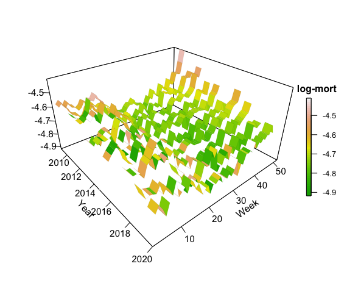
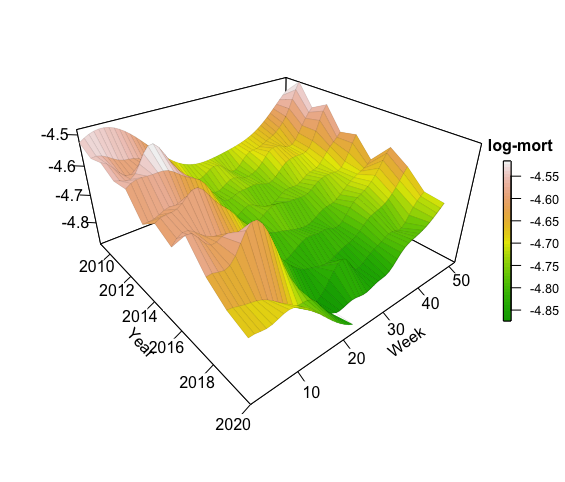

<style>
  .col2 {
    columns: 2 200px;         /* number of columns and width in pixels*/
    -webkit-columns: 2 200px; /* chrome, safari */
    -moz-columns: 2 200px;    /* firefox */
  }
  .list-group-item.active, .list-group-item.active:focus, .list-group-item.active:hover {
    background-color: #8c3c67;
  }
</style>

<style type="text/css">
body{ /* Normal  */
  font-size: 15px;
  height: 100%;
  overflow: auto;
}
html {
    overflow: hidden;
    height: 100%;
}
h1.title {
  font-size: 35px;
  font-weight: Bold;
  font-style: Italic;
  color:  #c64329;
}
h1 { /* Header 1 */
  font-size: 28px;
  color:  #c64329;
}
h2 { /* Header 2 */
  font-size: 25px;
  color: #c64329;
}
h3 { /* Header 3 */
  font-size: 20px;
  color: #c64329;
}
h4.author {
  font-size: 20px;
  color: #0047d6;
}
</style>

```{r, echo = FALSE, warning = FALSE, message = FALSE, setup}
knitr::opts_chunk$set(echo = TRUE, warning = FALSE, 
                      message = FALSE, comment = NA)
options("digits"=4)
```

```{r, echo = FALSE}
# library for visualization
library(kableExtra) 
library(plotly)
library(ggplot2)
library(shiny)
library(htmltools)
library(DT)


# library for model fitting
library(data.table)
library(DiceKriging)
library(rgenoud)
```

<hr>

The analysis below applies the SOGP framework to investigate **Covid-19** excess deaths. To do so we utilize the recently published **short-term mortality fluctuation** (STMF) dataset published by the Human Mortality Database. The STMF was expressly created to accomodate the critical need of short-term mortality analyses in response to the Covid-19 pandamic. The STMF contains detailed country-specific mortality, segregated by week (52 weeks per year), sex, and 3 age groups in 24 countries:

<div class="col2">
   Austria (AUT) \
   Belgium (BEL) \
   Bulgaria (BGR) \
   Switzerland (CHE) \
   Czech Republic (CZE) \
   Germany (DEUTNP) \
   Denmark (DNK) \
   Spain (ESP) \
   Estonia (EST)\
   Finland (FIN) \
   France (FRATNP) \
   England and Wales (GBRTENW) \
   Scotland (GBR_SCO) \
   Hungary (HUN) \
   Iceland (ISL) \
   Italy (ITA) \
   Lithuania (LTU) \
   Luxembourg (LUX) \
   Netherlands (NLD) \
   Norway (NOR) \
   Portugal (PRT)\
   Slovakia (SVK)\
   Sweden (SWE) \
   United States (USA) \
</div>  
<p></p>

The dataset is frequently updated. The analysis below is based on datasets last updated on **July 1, 2020**: 

```{r, covid19Data}
deaths <- readr::read_csv("https://www.mortality.org/Public/STMF/Outputs/stmf.csv", skip=1)
```

For our analysis we work with mortality rates (provided in STMF as the *RTotal* field) transformed to the *log scale*. We furthermore apply a few adjustments:

<!-- * Spain exhibited a spurious jump in reported RTotal since Week 40 in 2019, which we expect to be a data processing error. We manually scale it back to match prior weeks. -->

* We ignore Week 22 and 35 in England & Wales due to a persistent dip in reported deaths during those weeks due to national holidays.

* We drop the very last reported week of 2020 for CHE, FIN, HUN, LTU, NOR, ESP, SVK, SWE and USA which have steep declines due to incomplete reporting.

* We drop Iceland and Luxembourg which have different seasonality and much more noisy data due to very small population (more than 4 times smaller than all other countries considered)

* For purposes of illustration, we work with all-age, all-gender mortality


```{r, variablesCovid19Data}
deaths <- data.table(deaths)
deaths <- deaths[Sex=="b",.(Year,Week,RTotal,DTotal,CountryCode)] 
deaths <- deaths[,y:=log(RTotal)]
```


```{r, removeLastWeek, echo = FALSE}
deaths = deaths[!CountryCode %in% c("ISL","LUX")]
# remove the last week data point in 2020 for several countries Week %in% 21:25
deaths = deaths[-which(CountryCode=="SVK" & Year==2020 & Week == 18)]
deaths = deaths[-which(CountryCode=="HUN" & Year==2020 & Week %in% 21:22)]
deaths = deaths[-which(CountryCode=="CHE" & Year==2020 & Week %in% 22:23)]
deaths = deaths[-which(CountryCode %in% c("USA","SWE","FIN","LTU") & Year==2020 & Week == 24)]
deaths = deaths[-which(CountryCode %in% c("ESP","NOR") & Year==2020 & Week %in% 23:25)]
```

$\color{#c64329}{\textbf{Gaussian Process Regression in estimating 2020 excess deaths}}$

Our primary goal is to estimate excess mortality during 2020. This is defined as the difference between the observed and the expected number of deaths. Epidemiologists use excess mortality as a standard tool to understand the full impact of the pandemic. It does not only reflect deaths dirctly due to Covid-19 but also other causes associated with the pandemic, such as delayed or forgone care due to hospitals prioritizing Covid-19 emergencies or patients themselves staying away.


To define excess mortality requires agreeing on the baseline, i.e. the **expected number of deaths** if Covid-19 did not occur. A very simple method is to look at historical weekly mortality and then average. For example, one common metric is the median mortality over the previous 5 years, 2015-2019. However, this approach ignores trends in the data (specifically the mortality improvement factors whereby mortality gets better YoY), is sensitive to data outliers, and most importantly does not provide good uncertainty quantification. UQ is critical to answer the question of whether observed death counts are *statistically significant* or can be attributed to "random" fluctuations. Mortality data is intrinsically volatile and it is not straightforward to distinguish between frequent fluctuations that could happen versus an unambiguous Covid-19 spike.

Our analysis uses statistical learning, namely GP models to answer the above. To do so, we build a GP model on the historical data, taking for our training set Years 2010-2019, as well as Weeks 1-5 of 2020. We then use this training set to make probabilistic forecasts for Weeks 6-present of 2020 and compare this forecast to the observed mortality. The vertical blue line in the figure below delineates our training set from the forecast period.


The Figure below displays  the raw weekly log-mortality rates (after adjustments listed above) for each country indexed by weeks of the year. The 2020 observed log-mortality series is highlighted in red. 

* Most countries display strong annual seasonality, with mortality highest in Winter. In many countries, there is a smaller peak in Summer. 

* Not all countries have data available as early as 2010 in the STMF; for instance, starting year in Germany is 2016 and in the US is 2013. 

* Most countries have started to experience the outbreaks of Covid-19 in early to late March, so it is reasonable to assume that the first 5 weeks in 2020 don't include any excess deaths. 


```{r, echo = FALSE, plotCovid19Data, fig.hold='hold', out.width="33%"}
countryUnq <- unique(deaths$CountryCode)
par(mar= c(5,5,4,2))

for (i in 1:length(countryUnq)){
  current <- deaths[CountryCode==countryUnq[i]]
  year <- unique(current$Year)
  year <- year[-length(year)]
  year <- year[ year > 2010]
  plot(NULL, NULL, ylim = c(min(current[,y])-0.01,max(current[,y])+0.01),
       xlim = c(1,52), xlab = "Weeks", ylab = "Log-mortality",
       cex.lab = 1.5, cex.axis = 1.5, xaxs="i",yaxs="i",
       main = countryUnq[i])
  for (yr in year){
    lines(1:length(current[Year==yr,y]), 
          current[Year==yr,y], lwd = 1, 
          col = scales::alpha("gray",.75))
  }
  lines(1:length(current[Year==2020,y]),current[Year==2020,y],
        lwd = 3.5, col = "red")
  points(1:length(current[Year==2020,y]),current[Year==2020,y],
         pch = 19, cex = 0.65)
  abline(v = 5, col = "blue", lty = 2)
  text(5, min(current[,y]) + 0.025, "Feb 2, 2020", pos = 4)
  legend("topright", legend = c("2020 Log-mortality"), lwd = 2, lty = 1, 
         col = c("red"), bty = "n", pch = 21, pt.bg = "black", cex = 1.15)
}
```

To apply the Gaussian process modeling, we treat data as a 2-dimensional table, indexed by Weeks (1-52, coordinate 1) and Years (2010-2020, coordinate 2):

* We use the **Squared-Exponential** anisotropic kernel with two lengthscales $\theta_{Wk}, \theta_{Yr}$. 

* For the mean function we use a periodic **sinusoidal** trend in Week with an annual and semi-annual frequency to capture the aforementioned effects, as well as a **linear** trend in Year to capture a baseline constant mortality improvement factor:
$$m(x^n)= \beta_0 + \beta_{yr}x^n_{yr} + A_1 \cos\bigg(\dfrac{2\pi}{52}x^n_{wk}\bigg) + A_2\sin\bigg(\dfrac{2\pi}{52}x^n_{wk}\bigg)+ A_3\cos\bigg(\dfrac{4\pi}{52}x^n_{wk}\bigg)+ A_4\sin\bigg(\dfrac{4\pi}{52}x^n_{wk}\bigg)$$ 
where: 

  * $\beta_0$: intercept (baseline mortality in the country)
  * $\beta_{yr}$: linear coefficient in Year
  * $A_1$: amplitude for cosine wave with annual frequnecy
  * $A_2$: amplitude for sine wave with annual frequency
  * $A_3$: amplitude for cosine wave with semi-annual frequency
  * $A_4$: amplitude for sine wave with semi-annual frequency
  * We shift $x^n_{wk}$ by 4 weeks to better align with the winter mortality peaks around Feb 1 and summer mortality peaks around Aug 1
  
* We fit a constant observation noise $\sigma_\epsilon$ that is estimated as part of the MLE procedure

* We apply a genetic optimizer to fit the GP via MLE as implemented in the [DiceKriging](https://cran.r-project.org/web/packages/DiceKriging/index.html) R package.

* Within the 2-dim representation of our data, our training set has a *notched* shape (since we include a few weeks of 2020 in addition to full-year observations prior to that). This would be difficult to use in a time-series model but is straightforward in the spatial GP paradigm.

Our goal is to use a Gaussian Process model to: 

(1) smooth log-mortality rates in Year and Week dimensions; 

(2) perform out-of-sample predictions in 2020 starting from Week 5 to Week 22 (end of May 2020). 

```{r, echo = FALSE, fig.show = "hold", out.width = "50%", fig.align = "default"}


```

Note that GP is effectively a spatial model and does not have any time-series concepts embedded; it treats retrospective and future forecasts identically.


```{r, echo = FALSE, singleModels, include = FALSE, cache=TRUE}
mortData = deaths[(Year %in% 2010:2019)|(Year==2020 & Week %in% 1:5)]
mortData = mortData[-which(CountryCode=="GBRTENW" & Week %in% c(22,35))]

countryUnq = unique(mortData$CountryCode)

mortSingle_nug = list()
nug = list()
mortSingle = list()

for (i in which(countryUnq != "GBRTENW")){
  xMort = data.frame(year = mortData$Year[mortData$CountryCode==countryUnq[i]], 
                     week = mortData$Week[mortData$CountryCode==countryUnq[i]])
  yMort = mortData$y[mortData$CountryCode==countryUnq[i]]
  mortSingle_nug[[i]] = km(formula = ~ x.year + cos(2*pi/52*x.week) + sin(2*pi/52*x.week) + cos(4*pi/52*x.week) + sin(4*pi/52*x.week), 
                           design = data.frame(x = xMort), 
                           response = yMort,
                           nugget.estim=TRUE,
                           covtype="gauss",
                           optim.method="gen",
                           upper = c(20,20),
                           control=list(max.generations=100,pop.size=100,
                                        wait.generations=10,
                                        solution.tolerance=1e-5,
                                        print.level = 0))
  nug[i] = mortSingle_nug[[i]]@covariance@nugget 
  
  mortSingle[[i]] = km(formula = ~ x.year + cos(2*pi/52*x.week) + sin(2*pi/52*x.week) + cos(4*pi/52*x.week) + sin(4*pi/52*x.week), 
                       design = mortSingle_nug[[i]]@X, 
                       response = mortSingle_nug[[i]]@y,
                       noise.var = rep(nug[i],mortSingle_nug[[i]]@n), 
                       coef.trend = mortSingle_nug[[i]]@trend.coef,  
                       coef.cov = mortSingle_nug[[i]]@covariance@range.val,
                       coef.var = mortSingle_nug[[i]]@covariance@sd2, 
                       covtype = mortSingle_nug[[i]]@covariance@name)
}
```

```{r, echo = FALSE, include = FALSE, cache = TRUE}
# pre-specify lengthscales in England and Wales:
lengthscales = c()
for (i in which(!countryUnq %in% c("GBRTENW"))){
  lengthscales = rbind(lengthscales,mortSingle_nug[[i]]@covariance@range.val)
}

i = which(countryUnq=="GBRTENW")

xMort = data.frame(year = mortData$Year[mortData$CountryCode==countryUnq[i]], 
                     week = mortData$Week[mortData$CountryCode==countryUnq[i]])
yMort = mortData$y[mortData$CountryCode==countryUnq[i]]
mortSingle_nug[[i]] = km(formula = ~ x.year + cos(2*pi/52*(x.week-4)) + sin(2*pi/52*(x.week-4)) + cos(4*pi/52*(x.week-4)) + sin(4*pi/52*(x.week-4)), 
                           design = data.frame(x = xMort), 
                           response = yMort,
                           nugget.estim=TRUE,
                           covtype="gauss",
                           optim.method="gen",
                           upper = c(20,20),
                           control=list(max.generations=100,pop.size=100,
                                        wait.generations=10,
                                        solution.tolerance=1e-5,
                                        print.level = 1))
nug[i] = mortSingle_nug[[i]]@covariance@nugget 
  
mortSingle[[i]] = km(formula = ~ x.year + cos(2*pi/52*(x.week-4)) + sin(2*pi/52*(x.week-4)) + cos(4*pi/52*(x.week-4)) + sin(4*pi/52*(x.week-4)), 
                       design = mortSingle_nug[[i]]@X, 
                       response = mortSingle_nug[[i]]@y,
                       noise.var = rep(nug[i],mortSingle_nug[[i]]@n), 
                       coef.trend = mortSingle_nug[[i]]@trend.coef,  
                       coef.cov = c(mean(lengthscales[,1]),mean(lengthscales[,2])),
                       coef.var = mortSingle_nug[[i]]@covariance@sd2, 
                       covtype = mortSingle_nug[[i]]@covariance@name)
```


$\color{#c64329}{\textbf{Sample Gaussian Process Regression for Sweden all-Age Mortality}}$
Below is an illustration on the application of Gaussian Process to analyze and forecast time-series data in Sweden. 

<p></p>&nbsp; 
<p></p>

```{r, echo = FALSE, include=FALSE, swedenTimeseries}
i = which(countryUnq=="SWE")
yearsForecast = 2014:2020
weeksForecast  = 1:52
nYr = length(yearsForecast)
nWk = length(weeksForecast)
  
xPred = data.table(year = rep(yearsForecast, each = nWk),
                    week = rep(weeksForecast, nYr))
xPred = xPred[-which(year==2020 & week %in% 23:52)]

mortPred = predict(mortSingle[[i]], newdata=data.frame(x=xPred),
                   cov.compute=TRUE, se.compute=TRUE, type="UK")
  
xPred$yhat = mortPred$mean
xPred$u95 = xPred$yhat + 1.96*sqrt(mortPred$sd^2 + nug[[i]])
xPred$l95 = xPred$yhat - 1.96*sqrt(mortPred$sd^2 + nug[[i]])

mortSWE = deaths[CountryCode=="SWE" & Year %in% 2014:2020]
names(mortSWE)[1:2] = c("year","week")
xPred = merge(xPred, mortSWE, all.x = T, by = c("year","week"))
```

```{r, echo = FALSE}
input_year <- xPred$year
input_week <- xPred$week
input_day_of_week <- 1  # Monday

date_us_week <- as.Date(
        paste(input_year, input_week, input_day_of_week), 
        format = "%Y %U %u"
)
xPred$Date = date_us_week

blue_shade = adjustcolor("gray",alpha.f =0.40)

titleF = list(family = "sans serif", size = 22, color = "#c64329")
axesF =  list(family = "sans serif", size = 18)

fig <- plot_ly(xPred, x = ~ Date)
fig <- plot_ly(xPred, x = ~ Date, y = ~u95, type = 'scatter', mode = 'lines',
               line = list(color = blue_shade,
                           width = 0.01),
               showlegend = FALSE, name = '95% Upper')
fig <- fig %>% add_trace(y = ~ l95, type = 'scatter', mode = 'lines',
                         fill = 'tonexty', fillcolor = blue_shade, 
                         line = list(color = blue_shade,
                                     width = 0.01),
                         showlegend = FALSE, name = '95% Lower')
fig <- fig %>% add_lines(y = ~yhat,
                         name = "Mean forecast",
                         line = list(color = "darkblue", width = 2))
fig <- fig %>% add_lines(y = ~y,
                         name = "Observed value",
                         line = list(color = "red", width = 1, dash = "dot"),
                         showlegend = FALSE)
fig <- fig %>% add_trace(y = ~ y,  mode = "markers",
                           marker = list(color="red", 
                                         size = 3, 
                                         line=list(color="brown",width=1)),
                           showlegend = FALSE,
                           name = "Observed value")
fig <- fig %>% layout(
        title = list(font = titleF, text = "Sweden"),
        xaxis = list(
                showgrid = F, 
                showline = TRUE, 
                range = c("2014-01-05","2020-07-01"),
                rangeselector = list(
                        buttons = list(
                                list(
                                        count = 6,
                                        label = "6 mo",
                                        step = "month",
                                        stepmode = "backward"),
                                list(
                                        count = 1,
                                        label = "1 yr",
                                        step = "year",
                                        stepmode = "backward"),
                                list(
                                        count = 2,
                                        label = "2 yr",
                                        step = "year",
                                        stepmode = "backward"),
                                list(step = "all"))),
                
                rangeslider = list(type = "date",
                                   range = c("2014-01-05","2020-07-01"))),
        
        yaxis = list(title = "Log-mortality",
                     titlefont = axesF,
                     showgrid = F,
                      hoverformat = '.4f'),
        autosize = F,
        width = 1200,
        height = 400)
```

```{r, echo = FALSE}
library(htmltools)
browsable(div(style = "display: flex;  justify-content: center;",
        div(ggplotly(fig) %>% config(displayModeBar = F))))
```

$\color{#c64329}{\textbf{Excess mortality}}$

We can compare the GP-based mean forecast for 2020 against the observed weekly log-mortality rates to identify excess mortality. In the Figure below, the shaded region is the excess mortality starting at Week 11 (early March). Some countries have experienced much more severe impact than others. Observe that 2020 data ends at different weeks in different nations. We also note that in most countries there is a strong seasonal effect whereby mortality is expected to decrease as we enter the Summer months.

<p></p>&nbsp; 
<p></p>

```{r, echo = FALSE, group1}
P <- list()
for (i in 1:length(countryUnq)){

  yearsForecast = 2020
  weeksForecast  = 1:27
  nYr = length(yearsForecast)
  nWk = length(weeksForecast)
  
  xPred = data.table(year = rep(yearsForecast, nWk),
                     week = rep(weeksForecast, each = nYr))
  
  mortPred = predict(mortSingle[[i]], newdata=data.frame(x=xPred),
                     cov.compute=TRUE, se.compute=TRUE, type="UK")
  
  xPred$yhat = mortPred$mean
  
  obs20 = deaths[CountryCode==countryUnq[i] & Year == 2020]
  names(xPred)[1:2] = c("Year","Week")
  excess = merge(obs20, xPred, all.x = T, by = c("Year","Week"))
  excess = excess[,flg:=y>yhat]
  
  ex = which(excess$flg==TRUE & excess$Week>=11)
 
  titleF = list(family = "sans serif", size = 22, color = "#c64329")
  axesF =  list(family = "sans serif", size = 18)
  
  col_shaded = adjustcolor("brown",alpha.f =0.30)
  
  if (length(ex)==0){
    fig <- plot_ly()
    fig <- fig %>% add_lines(x = weeksForecast, y = xPred$yhat,
                                 mode = "lines",
                                 name = "Mean forecasts",
                                 line = list(color = "steelblue", width = 2))
    fig <- fig %>% add_lines(x = 1:length(obs20$y), y = obs20$y,
                                 mode = "lines",
                                 showlegend = TRUE,
                                 name = "Observed values",
                                 line = list(color = "orangered", width = 2))
     fig <- fig %>% add_markers(x = length(obs20$y), y = obs20$y[length(obs20$y)], 
                           marker = list(color="red", 
                                         size=4, 
                                         line=list(color="brown",width=1)),
                           showlegend = FALSE,
                           hoverinfo = "y",
                           hovertemplate = paste(
                            "<b>Last week reported</b><br>",
                            "Log-mort: %{y:.4f}<br>",
                            "<extra></extra>"))
    fig <- fig %>% add_annotations(x = length(obs20$y) + 2, y = obs20$y[length(obs20$y)]+0.005,
                               showarrow = FALSE,
                               text = paste("Wk ",length(obs20$y)),
                               font = list(color = '#264E86',
                                           family = 'sans serif',
                                           size = 15))
    fig <- fig %>% layout(xaxis = list(title = 'Weeks', 
                                     titlefont = axesF, 
                                     showgrid = F, 
                                     showline = TRUE, 
                                     ticks = "outside",
                                     range = c(1,27)),
                        yaxis = list(title = 'Log-Mortality Rate', 
                                     titlefont = axesF, 
                                     showgrid = F, 
                                     ticks = "outside",
                                     showline = TRUE,
                                      hoverformat = '.4f'),
                        title = list(text = paste(countryUnq[i],yearsForecast, sep = " "),
                                     font = titleF,
                                     x = 0.0,
                                     y = 1.35),
                        legend = list(x = 0.5, y = 1.35,
                                      font = list(size = 10)),
                        autosize = F,
                        width = 400, 
                        height = 325)
    P[[i]] <- fig
  } else {
    fig <- plot_ly()
    fig <- fig %>% add_lines(x = weeksForecast, y = xPred$yhat,
                                 mode = "lines",
                                 name = "Mean forecasts",
                                 line = list(color = "steelblue", width = 2))
    fig <- fig %>% add_lines(x = 1:length(obs20$y), y = obs20$y,
                                 mode = "lines",
                                 showlegend = TRUE,
                                 name = "Observed values",
                                 line = list(color = "orangered", width = 2))
    fig <- fig %>% add_ribbons(x = ex,
                                   ymin = excess$yhat[ex],
                                   ymax = excess$y[ex],
                                   line = list(color = 'orangered',
                                               width = 0.10),
                                   fillcolor = col_shaded,
                                   showlegend = TRUE,
                                   name = "Excess mortality")
    fig <- fig %>% add_markers(x = length(obs20$y), y = obs20$y[length(obs20$y)], 
                           marker = list(color="red", 
                                         size=4, 
                                         line=list(color="brown",width=1)),
                           showlegend = FALSE,
                           hoverinfo = "y",
                           hovertemplate = paste(
                            "<b>Last week reported</b><br>",
                            "Log-mort: %{y:.4f}<br>",
                            "<extra></extra>"))
    fig <- fig %>% add_annotations(x = length(obs20$y) + 2, y = obs20$y[length(obs20$y)]+0.005,
                               showarrow = FALSE,
                               text = paste("Wk ",length(obs20$y)),
                               font = list(color = '#264E86',
                                           family = 'sans serif',
                                           size = 15))
    fig <- fig %>% layout(xaxis = list(title = 'Weeks', 
                                     titlefont = axesF, 
                                     showgrid = F, 
                                     showline = TRUE, 
                                     ticks = "outside",
                                     range = c(1,27)),
                        yaxis = list(title = 'Log-Mortality Rate', 
                                     titlefont = axesF, 
                                     showgrid = F, 
                                     ticks = "outside",
                                     showline = TRUE,
                                      hoverformat = '.4f'),
                        title = list(text = paste(countryUnq[i],yearsForecast, sep = " "),
                                     font = titleF,
                                     x = 0.0,
                                     y = 1.35),
                        legend = list(x = 0.5, y = 1.35,
                                      font = list(size = 10)),
                        autosize = F,
                        width = 400, 
                        height = 325)
  P[[i]] <- fig
  }
}
```


```{r, echo = FALSE}
browsable(div(style = "display: flex;  justify-content: center; height: calc(50vh - 50px); gap: 40px",
        div(ggplotly(P[[1]]) %>% config(displayModeBar = F)),
        div(ggplotly(P[[2]]) %>% config(displayModeBar = F)),
        div(ggplotly(P[[3]]) %>% config(displayModeBar = F))))
```

```{r, echo = FALSE}
browsable(div(style = "display: flex;  justify-content: center; height: calc(50vh - 50px); gap: 40px",
        div(ggplotly(P[[4]]) %>% config(displayModeBar = F)),
        div(ggplotly(P[[5]]) %>% config(displayModeBar = F)),
        div(ggplotly(P[[6]]) %>% config(displayModeBar = F))))
```

```{r, echo = FALSE}
browsable(div(style = "display: flex;  justify-content: center; height: calc(50vh - 50px); gap: 40px",
        div(ggplotly(P[[7]]) %>% config(displayModeBar = F)),
        div(ggplotly(P[[8]]) %>% config(displayModeBar = F)),
        div(ggplotly(P[[9]]) %>% config(displayModeBar = F))))
```

```{r, echo = FALSE}
browsable(div(style = "display: flex;  justify-content: center; height: calc(50vh - 50px); gap: 40px",
        div(ggplotly(P[[10]]) %>% config(displayModeBar = F)),
        div(ggplotly(P[[11]]) %>% config(displayModeBar = F)),
        div(ggplotly(P[[12]]) %>% config(displayModeBar = F))))
```

```{r, echo = FALSE}
browsable(div(style = "display: flex;  justify-content: center; height: calc(50vh - 50px); gap: 40px",
        div(ggplotly(P[[13]]) %>% config(displayModeBar = F)),
        div(ggplotly(P[[14]]) %>% config(displayModeBar = F)),
        div(ggplotly(P[[15]]) %>% config(displayModeBar = F))))
```

```{r, echo = FALSE}
browsable(div(style = "display: flex;  justify-content: center; height: calc(50vh - 50px); gap: 40px",
        div(ggplotly(P[[16]]) %>% config(displayModeBar = F)),
        div(ggplotly(P[[17]]) %>% config(displayModeBar = F)),
        div(ggplotly(P[[18]]) %>% config(displayModeBar = F))))
```

```{r, echo = FALSE}
browsable(div(style = "display: flex;  justify-content: center; height: calc(50vh - 50px); gap: 40px",
        div(ggplotly(P[[19]]) %>% config(displayModeBar = F)),
        div(ggplotly(P[[20]]) %>% config(displayModeBar = F)),
        div(ggplotly(P[[21]]) %>% config(displayModeBar = F))))
```

```{r, echo = FALSE}
browsable(div(style = "display: flex;  justify-content: center; height: calc(50vh - 50px); gap: 40px",
        div(ggplotly(P[[22]]) %>% config(displayModeBar = F))))
```

$\color{#c64329}{\textbf{Credible Bands}}$

To highlight the uncertainty quantification available with a GP model, we plot below the credible intervals around our GP-based 2020 forecasts. Below, we plot the mean forecasts for each country along with the 80% and 95% credible bands. We also show the 5-year medians and the observed 2020 rate for comparison purpose. 

<p></p>&nbsp; 
<p></p>

```{r, echo = FALSE}
P = list()
for (i in 1:length(countryUnq)){
  yearsForecast = 2020
  weeksForecast  = 1:26
  nYr = length(yearsForecast)
  nWk = length(weeksForecast)
  
  xPred = data.table(year = rep(yearsForecast, nWk),
                     week = rep(weeksForecast, each = nYr))
  
  mortPred = predict(mortSingle[[i]], newdata=data.frame(x=xPred),
                     cov.compute=TRUE, se.compute=TRUE, type="UK")
  
  xPred$yhat = mortPred$mean
  xPred$l95 = xPred$yhat - 1.96*sqrt(mortPred$sd^2 + nug[[i]])
  xPred$u95 = xPred$yhat + 1.96*sqrt(mortPred$sd^2 + nug[[i]])
  xPred$l80 = xPred$yhat - 1.282*sqrt(mortPred$sd^2 + nug[[i]])
  xPred$u80 = xPred$yhat + 1.282*sqrt(mortPred$sd^2 + nug[[i]])
  
  obs20 = deaths[CountryCode==countryUnq[i] & Year == 2020]
  
  # find median log-mortality in the last 5 years 2015--2019:
  obs5Yr = deaths[CountryCode==countryUnq[i] & Year %in% 2015:2019]
  med5Yr = obs5Yr[,.(med=median(y)),by=Week]
  
  col_tran1 = adjustcolor("lightblue",alpha.f =0.40)
  col_tran2 = adjustcolor("lightblue",alpha.f =0.90)
  
  titleF = list(family = "sans serif", size = 22, color = "#c64329")
  axesF =  list(family = "sans serif", size = 18)
  
  fig <- plot_ly()
  fig <- fig %>% add_ribbons(x = weeksForecast,
                             ymin = xPred$l95,
                             ymax = xPred$u95,
                             line = list(color = 'lightblue', 
                                         width = 0.10),
                             fillcolor = col_tran1,
                             name = "95% CB")
  fig <- fig %>% add_ribbons(x = weeksForecast,
                             ymin = xPred$l80,
                             ymax = xPred$u80,
                             line = list(color = 'lightblue', 
                                         width = 0.10),
                             fillcolor = col_tran2,
                             name = "80% CB")
  fig <- fig %>% add_lines(x = weeksForecast, y = xPred$yhat,
                           mode = "lines",
                           name = "Predicted value",
                           line = list(color = "steelblue", width = 3))
   fig <- fig %>% add_lines(x = 1:22, y = med5Yr$med[1:22],
                           mode = "lines",
                           showlegend = FALSE,
                           hovertemplate = paste(
                            "<b>Historical median ('15-'19)</b><br>",
                            "Median: %{y:.4f}<br>",
                            "Week: %{x:}<br>",
                            "<extra></extra>"),
                           line = list(color = "#B158F5", width = 2.5,
                                       dash = "dot"))
  fig <- fig %>% add_annotations(x = 1, y = min(xPred$l95),
                                 showarrow = TRUE,
                                 text = "",
                                 ax = 4.75,
                                 ay = min(xPred$l95),
                                 xref = "x", yref = "y",
                                 axref = "x", ayref = "y",
                                 arrowcolor = '#264E86',
                                 arrowsize = .5)
  fig <- fig %>% add_annotations(x = 3, y = min(xPred$l95)+0.025,
                                 showarrow = FALSE,
                                 text = "In-sample",
                                 font = list(color = '#264E86',
                                             family = 'sans serif',
                                             size = 12))
  fig <- fig %>% add_annotations(x = 9, y = min(xPred$l95),
                                 showarrow = TRUE,
                                 text = "",
                                 ax = 5.25,
                                 ay = min(xPred$l95),
                                 xref = "x", yref = "y",
                                 axref = "x", ayref = "y",
                                 arrowcolor = '#264E86',
                                 arrowsize = .5)
  fig <- fig %>% add_annotations(x = 7, y = min(xPred$l95) + 0.025,
                                 showarrow = FALSE,
                                 text = "Projected",
                                 font = list(color = '#264E86',
                                             family = 'sans serif',
                                             size = 12))
  fig <- fig %>% add_segments(x = 5, xend = 5, 
                              y = min(c(xPred$l95,obs20$y)),
                              yend = max(c(xPred$u95,obs20$y)),
                              line = list(color = "#264E86", width = 0.5,
                                          dash = "dot"),
                              showlegend = FALSE)
  fig <- fig %>% add_lines(x = 1:length(obs20$y), y = obs20$y,
                           mode = "lines",
                           showlegend = FALSE,
                           line = list(color = "brown", width = 2))
  fig <- fig %>% add_markers(x = 1:length(obs20$y), y = obs20$y, 
                             marker = list(color="red", 
                                           size=5, 
                                           line=list(color="brown",width=1)),
                             showlegend = TRUE,
                             name = "Observed")
  fig <- fig %>% layout(xaxis = list(title = 'Weeks', 
                                     titlefont = axesF, 
                                     showgrid = F, 
                                     showline = TRUE, 
                                     ticks = "outside",
                                     range = c(1,25)),
                        yaxis = list(title = 'Log-Mortality Rate', 
                                     titlefont = axesF, 
                                     showgrid = F, 
                                     ticks = "outside",
                                     showline = TRUE,
                                      hoverformat = '.4f'),
                        title = list(text = paste(countryUnq[i],yearsForecast, sep = " "),
                                     font = titleF,
                                     x = 0.0,
                                     y = 1.35),
                        legend = list(orientation = "h",
                                      x = 0.5, y = 1.15),
                        autosize = F,
                        width = 400, 
                        height = 350)
  P[[i]] <- fig
}
```

<p></p>&nbsp; 
<p></p>

```{r, echo = FALSE}
browsable(div(style = "display: flex;  justify-content: center; height: calc(55vh - 55px); gap: 40px",
        div(ggplotly(P[[1]]) %>% config(displayModeBar = F)),
        div(ggplotly(P[[2]]) %>% config(displayModeBar = F)),
        div(ggplotly(P[[3]]) %>% config(displayModeBar = F))))
```


```{r, echo = FALSE}
browsable(div(style = "display: flex;  justify-content: center; height: calc(55vh - 55px); gap: 40px",
        div(ggplotly(P[[4]]) %>% config(displayModeBar = F)),
        div(ggplotly(P[[5]]) %>% config(displayModeBar = F)),
        div(ggplotly(P[[6]]) %>% config(displayModeBar = F))))
```


```{r, echo = FALSE}
browsable(div(style = "display: flex;  justify-content: center; height: calc(55vh - 55px); gap: 40px",
        div(ggplotly(P[[7]]) %>% config(displayModeBar = F)),
        div(ggplotly(P[[8]]) %>% config(displayModeBar = F)),
        div(ggplotly(P[[9]]) %>% config(displayModeBar = F))))
```


```{r, echo = FALSE}
browsable(div(style = "display: flex;  justify-content: center; height: calc(55vh - 55px); gap: 40px",
        div(ggplotly(P[[10]]) %>% config(displayModeBar = F)),
        div(ggplotly(P[[11]]) %>% config(displayModeBar = F)),
        div(ggplotly(P[[12]]) %>% config(displayModeBar = F))))
```


```{r, echo = FALSE}
browsable(div(style = "display: flex;  justify-content: center; height: calc(55vh - 55px); gap: 40px",
        div(ggplotly(P[[13]]) %>% config(displayModeBar = F)),
        div(ggplotly(P[[14]]) %>% config(displayModeBar = F)),
        div(ggplotly(P[[15]]) %>% config(displayModeBar = F))))
```

```{r, echo = FALSE}
browsable(div(style = "display: flex;  justify-content: center; height: calc(55vh - 55px); gap: 40px",
        div(ggplotly(P[[16]]) %>% config(displayModeBar = F)),
        div(ggplotly(P[[17]]) %>% config(displayModeBar = F)),
        div(ggplotly(P[[18]]) %>% config(displayModeBar = F))))
```

```{r, echo = FALSE}
browsable(div(style = "display: flex;  justify-content: center; height: calc(55vh - 55px); gap: 40px",
        div(ggplotly(P[[19]]) %>% config(displayModeBar = F)),
        div(ggplotly(P[[20]]) %>% config(displayModeBar = F)),
        div(ggplotly(P[[21]]) %>% config(displayModeBar = F))))
```

```{r, echo = FALSE}
browsable(div(style = "display: flex;  justify-content: center; height: calc(55vh - 55px); gap: 40px",
        div(ggplotly(P[[22]]) %>% config(displayModeBar = F))))
```

<p></p>&nbsp; 
<p></p>

We note that in several countries, there is no statistically significant deviation from expected mortality. In other cases, such as Spain and USA, the Covid-19 spikes are clear.

A few remarks can be made relative to the historical 5-year median:

* The historical median is much noisier and hence is problematic as a baseline compared to the smoothed GP forecast

* In most countries there is a strong annual trend, namely forecasted mortality is above the historical median. This occurs due to overall aging of the populations driving up total mortality counts. 

* As a result of this gap, the estimated excess deaths in our framework are **lower** compared to relying on historical median.


$\color{#c64329}{\textbf{Excess deaths}}$


```{r, echo = FALSE, tableExcess}
excess = c()
for (i in 1:length(countryUnq)){
  yearsForecast = 2020
  weeksForecast  = 1:25
  nYr = length(yearsForecast)
  nWk = length(weeksForecast)

  xPred = data.table(year = rep(yearsForecast, nWk),
                   week = rep(weeksForecast, each = nYr))

  mortPred = predict(mortSingle[[i]], newdata=data.frame(x=xPred),
                   cov.compute=TRUE, se.compute=TRUE, type="UK")
  xPred$yhat = mortPred$mean

  mort = deaths[CountryCode==countryUnq[i] & Year==2020]
  names(mort)[1:2] = c("year","week")
  xPred = merge(xPred, mort, all.x = T, by = c("year","week"))

  TExposure = xPred$DTotal[1]/xPred$RTotal[1]
  xPred = xPred[,EDTotal:=TExposure*exp(yhat)]
  xPred = xPred[,excess:=round(DTotal-EDTotal)]
  xPred = xPred[complete.cases(xPred)]

  excess = rbind(excess,xPred[,.(CountryCode,week,excess)])
}
excess$CountryCode = as.factor(excess$CountryCode)
levels(excess$CountryCode) = c("Austria","Belgium","Bulgaria","Switzerland","Czech Republic","Germany","Denmark",
                               "Spain","Estonia", "Finland","France","Scotland","England & Wales",
                               "Hungary","Italy","Lithuania","Netherlands","Norway",
                               "Portugal","Slovakia", "Sweden","USA")
```

```{r, echo=FALSE}
excessSum <- data.frame(Country=unique(excess$CountryCode),excessTotal=rep(0,length(countryUnq)),lastWeek=rep(0,length(countryUnq)))
for (i in 1:length(excessSum$Country)) {
  excessSum$excessTotal[i] <- sum(excess$excess[excess$CountryCode == excessSum$Country[i] ])
  excessSum$lastWeek[i] <- max(excess$week[excess$CountryCode == excessSum$Country[i] ])
  
}
colnames(excessSum) <- c("Country","Total Excess Deaths in 2020","Last Week Reported")
df_html <- knitr::kable(excessSum, "html")
kableExtra::kable_styling(df_html,bootstrap_options = "striped", full_width = F)  

```


$\color{#c64329}{\textbf{GP Diagnostics}}$

For completeness, we report below the fitted GP mean functions for each country, as well as the GP hyperparameters. We note that our basic model had difficulty finding appropriate lengthscales for E&W and was fitted manually for now. 

  
```{r, echo = FALSE}
Trend = c()
for (i in 1:length(countryUnq)){
  Trend = rbind(Trend, mortSingle[[i]]@trend.coef)
}
colnames(Trend) = c("Intercept","Year trend","A_1","A_2","A_3","A_4")
rownames(Trend) = countryUnq
```

```{r, echo = FALSE}
df_html <- knitr::kable(Trend, "html")
kableExtra::kable_styling(df_html,bootstrap_options = "striped", full_width = F)
```

```{r, echo = FALSE}
CovKer = c()
for (i in 1:length(countryUnq)){
  CovKer = rbind(CovKer, c(mortSingle[[i]]@covariance@range.val, mortSingle[[i]]@covariance@sd2, nug[[i]]))
}
rownames(CovKer) <- countryUnq
colnames(CovKer) <- c("Year Lengthscale","Week Lengthscale","Process variance", "Observ. Noise")
```

Hyper-parameters in the covariance function for each country:

```{r, echo = FALSE}
df_html <- knitr::kable(CovKer, "html")
kableExtra::kable_styling(df_html,bootstrap_options = "striped", full_width = F)
```


